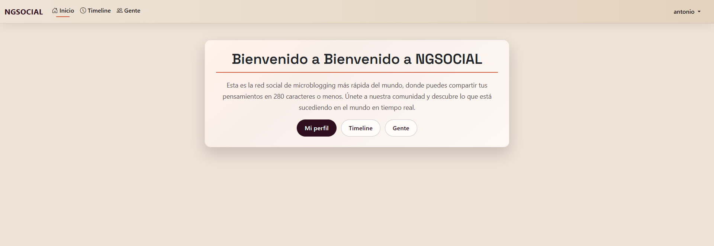
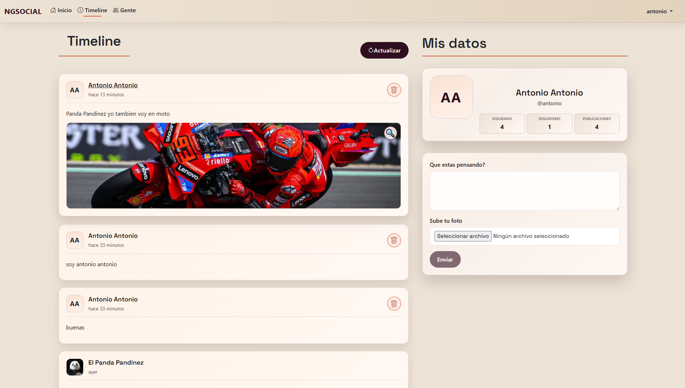
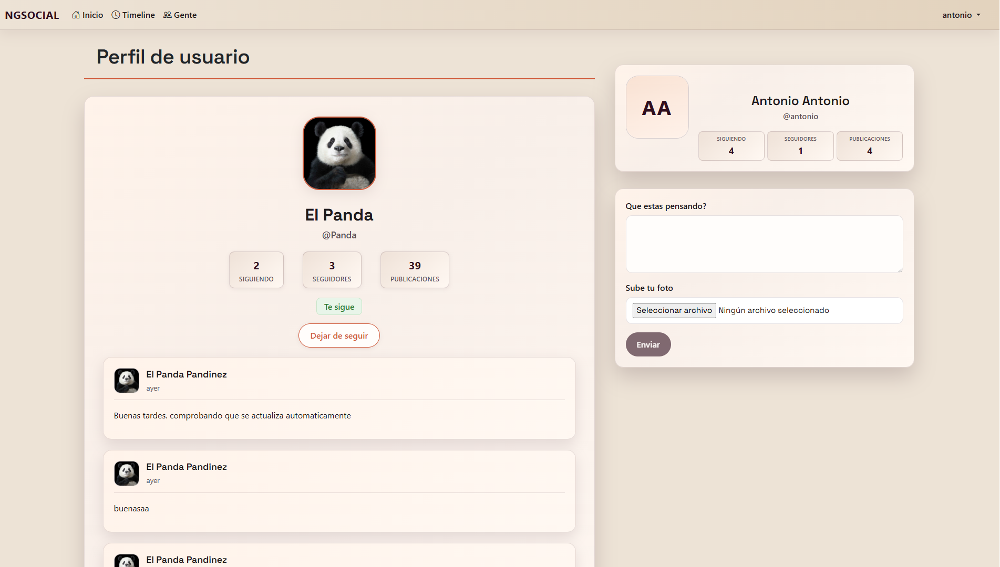

# 🚀 SocialApp - Cliente Angular

Bienvenido al cliente de SocialApp, una red social moderna construida con Angular.

---

## ✨ Características principales

- 📝 Publica textos y fotos
- 🖼️ Vista previa de imágenes y modal elegante
- 🗑️ Elimina tus publicaciones con confirmación animada
- 👤 Perfil de usuario con estadísticas
- 🔒 Autenticación y gestión de usuarios
- 📱 Responsive y diseño atractivo

---

## ⚡ Instalación rápida

```bash
npm install
npm start
```

---


## 🖥️ Estructura del proyecto

```
CursoREDES/
├── api/                # Backend Node.js/Express
│   ├── app.js
│   ├── index.js
│   ├── package.json
│   ├── controllers/    # Lógica de negocio (user, publication, follow, message)
│   ├── models/         # Modelos de datos (user, publication, follow, message)
│   ├── routes/         # Rutas de la API REST
│   ├── middlewares/    # Middlewares (autenticación, etc)
│   ├── services/       # Servicios auxiliares (JWT, etc)
│   └── uploads/        # Imágenes de usuarios y publicaciones
│       ├── users/
│       └── publications/
│
├── client/             # Cliente Angular
│   ├── src/
│   │   ├── app/
│   │   │   ├── components/
│   │   │   │   ├── home/
│   │   │   │   ├── login/
│   │   │   │   ├── profile/
│   │   │   │   ├── publications/
│   │   │   │   ├── register/
│   │   │   │   ├── sidebar/
│   │   │   │   ├── timeline/
│   │   │   │   ├── user-edit/
│   │   │   │   └── users/
│   │   │   ├── models/
│   │   │   ├── pipes/
│   │   │   └── services/
│   │   ├── assets/
│   │   ├── index.html
│   │   └── ...
│   ├── angular.json
│   ├── package.json
│   └── ...
└── README.md
```

---

## 🖌️ Estilo y experiencia

- Paleta cálida y moderna
- Animaciones suaves en modales y alertas
- Botones redondeados y feedback visual
- Mensajes de éxito/error con iconos y colores

---

## 📸 Capturas







---

## 🪄 Experiencia de usuario avanzada

- **Pantalla de inicio:** Actualmente en construcción, será el punto de entrada principal a la red social.
- **Usuarios:** Visualiza todos los usuarios dados de alta y accede a sus perfiles haciendo clic sobre ellos.
- **Timeline:** Explora las publicaciones de todos los usuarios, amplía imágenes con un solo clic, borra tus propias publicaciones mediante un modal animado y navega fácilmente por los posts.
- **Perfil de usuario:** Consulta exclusivamente las publicaciones y estadísticas de cada usuario, como número de seguidores, seguidos y publicaciones.

- **Animaciones profesionales:** Transiciones suaves en modales, alertas y botones para una experiencia moderna y fluida.
- **Modal de borrado personalizado:** Al eliminar una publicación, aparece un modal elegante con animación y confirmación.
- **Autoscroll inteligente:** Al cargar más publicaciones, la vista se desplaza automáticamente para mostrar el nuevo contenido.
- **Feedback visual:** Mensajes de éxito y error con iconos y colores, que desaparecen automáticamente.
- **Botones y formularios:** Estilizados y con feedback visual al interactuar.

Todo el diseño y las interacciones están pensados para ser intuitivos y agradables, siguiendo una línea visual coherente en toda la app.
---

## 🤝 Contribuir

¡Las contribuciones son bienvenidas! Abre un issue o pull request para sugerir mejoras.

---

## 📝 Licencia

MIT

---

> Hecho con ❤️ aprendiendo y poniendole mucho empeño. El proyecto sigue desarrollandose, por lo que mas funcionalidades llegarán pronto! 
